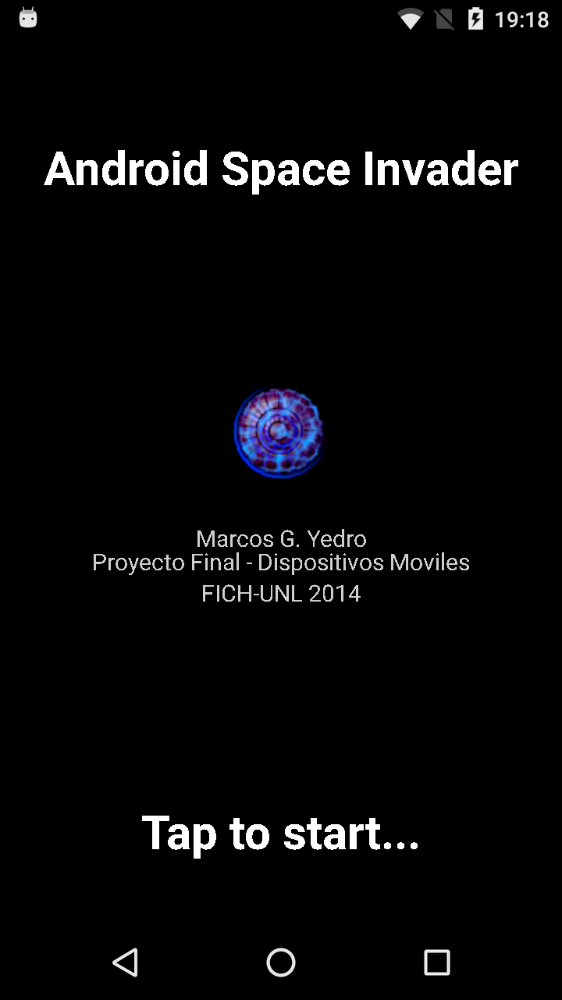

# Android Space Invader 

_Simple retro game [space-invaders](https://en.wikipedia.org/wiki/Space_Invaders) like for Android platform._

## Motivation
<p align="justify">
I built this video game in 2014 as part of a mobile devices programming course I took. It was developed using just native Android, no frameworks were used. I decided to upload it for two reasons. On the one hand, because it may be useful to people who are getting started on android game programming. On the other hand, because when I re-discover it after a couple of years, I found it nice in some way, so I wanted to preserve it.
</p>

<p align="center">
  
</p>


## Controls
<p align="justify">
Controls are simple. Just tap to shoot and turn your device left and right to move the ship. Accelerometer values will be used to control the horizontal position. Destroy all enemy ships to pass to the level.
</p>

<p align="center">
  
</p>


## Building
Building from source should be straightforward. Clone the repository and import the project with [Android Studio](https://developer.android.com/studio/).

## Design Overview
A `GameView` object is created in `MainActivity.java` constructor and set as content view.
```java
gameView = new GameView(this,this);
setContentView(gameView);
```
`GameView` extends from [SurfaceView](https://developer.android.com/reference/android/view/SurfaceView) and it is the place where the game logic lives. A callback listener to the holder is added in the constructor. The `surfaceCreated` method is overriden to start the `gameLoopThread`.
This thread will call the `onDraw` method of the `GameView` class within a loop. This method will draw all the game components with its updated positions each time it is called.
A disclaimer here: If you take a look at the code, you will find a lot of stuff to improve (mostly due to time restrictions and student-level android programming). It is not my idea to spend much more time improving this project however, contributions are always welcome.

## Credits
- The high-level design was taken from [edu4java](http://edu4java.com) site, using ideas from the [android game programming](http://edu4java.com/en/androidgame/androidgame1.html) tutorial.

- Sprites were taken from [MillionthVector](http://millionthvector.blogspot.com/p/free-sprites.html). It is a cool blog with many sprites licensed under Creative Commons license.

- I had to change the original music because I was not able to find any reference to it on the web. When looking for new songs, I found this great website [patrickdearteaga.com](https://patrickdearteaga.com/chiptune-8-bit-retro/) which contains lots of royalty-free soundtracks for video games. I picked the one called _"New Hope"_


## License
This project is licensed under GNU General Public License. See the [LICENSE](LICENSE) file for details.